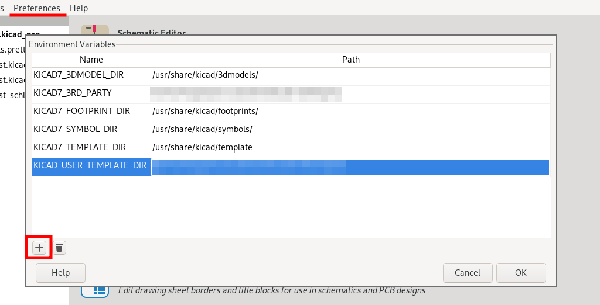
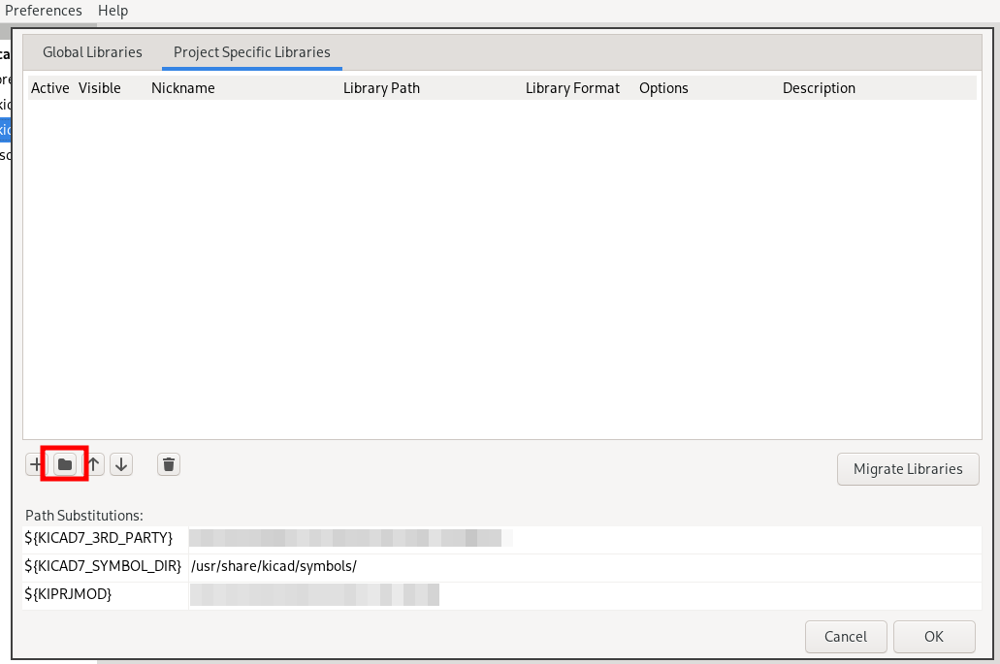
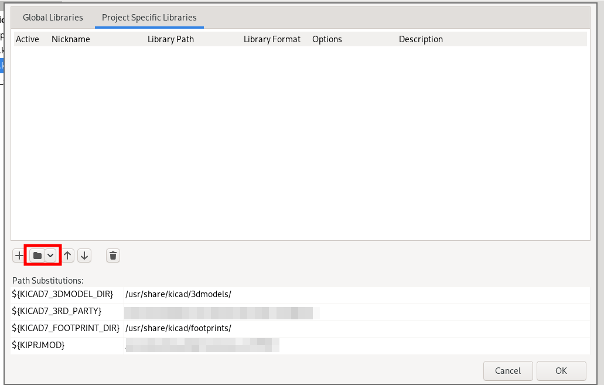

# KiML: KiCAD MAXLAB Library

KIML is a KiCAD library aimed at providing a decent tool for commercial hardware
projects, where DFM and BOM management are crucial parts of the process.

In KiML, every schematic symbol contains supplier information, some important
data about the component it represents, an associated footprint and a 3D model.

This concept, called the "atomic components", is viable for project phases beyond
the prototyping, when parts supply and reuse are more important than exotic
features of the abstract component.

For example, you might use a resistor of 100Ohm in your design. But what
_actual_ 100Ohm resistor is it? What manufacturer number is it? Where can you
buy it? Is there enough stock? What supplier can provide you with that?

KIML is there to answer those questions, and many more, by providing a database
where you can look up the component of interest.

And if the desired part is missing, you can always extend KIML by adding your
own part using the rest of KIML as an example, and reuse that part
in your next awesome project.

## Status of Implementation

The KIML is in active development, and it isn't stable yet. It will be populated
with additional components and structure going to change (hopefully not too
much) in the near future.

Make sure you maintain your own fork of KIML and track changes there.

Any contribution is welcomed.

## How to Install KIML

Note: the instructions below are valid for Linux, however, there are no reasons
to think it wouldn't work on Windows or MacOS.

1. Download KIML into a directory of your choice:

   ```
   git clone ...
   ```

2. Open KiCAD.

3. Go to "Preferences -> Configure Paths" and click "+" button:

   

3. Place the new environment variable with the name `KIML_ROOT` and a path
   to recently downloaded KIML:

   

And that's it! You're now ready to use KIML. Proceed with the next section to
know how.

## How to Use It in Your Project

Rest of the process is similar as with any other external KiCAD library:

1. Open your project in KiCAD.

2. Navigate to "Preferences -> Manage Symbol Libraries...", click on "Project
   Specific Libraries" tab. Click "Add existing library to table" button:

   

3. In the window appeared, navigate to a directory with recently downloaded KIML.
   Enter `symbols` directory. Select all symbols available:

   

4. Observe a prefix is automatically added to all libraries in the table.
   If you don't observe the `${KIML_ROOT}` prefix there, please check the
   installation section to make sure `KIML_ROOT` is added to KiCAD.

   

5. Repeat the process for footprint libraries. Go to "Preferences -> Manage
   Footprint Libraries...", click on "Project Specific Libraries" tab. Click
   "Add existing library to table" button.

   

6. In the window appeared, navigate to a directory with recently downloaded KIML.
   Enter `footprints` directory. Select all footprints available:

   

7. Same as with symbol libraries, observe a prefix is automatically added
   to all libraries in the table.
   If you don't observe the `${KIML_ROOT}` prefix there, please check the
   installation section to make sure `KIML_ROOT` is added to KiCAD.

   ... pic


All libraries are now added and you're ready to go. Open the schematic editor
and enjoy adding atomic parts to your design!

## Licesing, Owndership and Commercial Use

KIML is a property of [MAXLABIO INC.](http://maxlab.io).

KIML is distributed under MIT license.

You're free to use KIML in any open or closed source projects without prior
consent.

## How to Contribute

If you want to report the error in the parts description or have questions
about KIML, please open an issue in GitHub.

If you're willing to extend the library, feel free to open the pull request.

You will be asked to sign [Developer Certificate of Origin](https://developercertificate.org/)
in order for your commits to be processed.

Please keep PRs small, one or two components at a time, since they're reviewed
manually and it's tedious to process lots of parts at the same time.
